# **Credit Scorecard Model**
#### Virtual Internship Experience : Home Credit Indonesia – Data Scientist
#### Author : Althaaf Athaayaa Daffa Qushayyizidane


## **Background**

> Context: 

#### I am involved in a project with the company Home Credit Indonesia. I will be collaborating with various other departments in this project to provide technology solutions for the company. I was asked to build a credit score model to ensure that customers who are able to make repayments are not rejected when applying for a loan, and that loans are given with a principal, maturity, and repayment calendar that will motivate customers to succeed. In addition, I also had to provide business recommendations for the company.
<br>
<br>

## **Steps**

- Data Preprocessing
- Exploratory Data Analysis
- Feature Engineering
- Modeling
<br>
<br>
<br>

## **Prerequisite**

- Numpy (1.23.5)
- Pandas (1.5.3)
- Seaborn (0.12.2)
- Matplotlib (3.7.0)
- Scikit-learn (1.2.1)
- Scipy (1.10.0)
<br>
<br>
<br>

# **Getting Started**

## **Import Library**

```sh
# Melakukan import library
import warnings
warnings.filterwarnings('ignore')

import numpy as np
import pandas as pd
import seaborn as sns
from scipy import stats
import matplotlib.pyplot as plt
from matplotlib import rcParams
%matplotlib inline
from sklearn.preprocessing import MinMaxScaler, StandardScaler, RobustScaler
from scipy.stats import boxcox
from imblearn import under_sampling, over_sampling
import gdown
from sklearn.model_selection import train_test_split

from mlxtend.plotting import plot_confusion_matrix
from sklearn.metrics import accuracy_score, precision_score, recall_score, f1_score, roc_auc_score, roc_curve, confusion_matrix, fbeta_score, make_scorer
from sklearn.experimental import enable_halving_search_cv
from sklearn.model_selection import cross_validate, RandomizedSearchCV, GridSearchCV, HalvingGridSearchCV
from sklearn.ensemble import RandomForestClassifier, GradientBoostingClassifier
from sklearn.linear_model import LogisticRegression, Ridge, Lasso, ElasticNet
from sklearn.svm import SVR
from sklearn.neighbors import KNeighborsClassifier
from sklearn.tree import DecisionTreeClassifier
from xgboost import XGBClassifier
from lightgbm import LGBMClassifier, reset_parameter, LGBMClassifier

import shap

from scipy.stats import randint as sp_randint
from scipy.stats import uniform as sp_uniform
```
<br>
<br>
<br>

## Load Data

```sh
dataframe_ori = pd.read_csv("application_train.csv")
dataframe_ori.head()
```
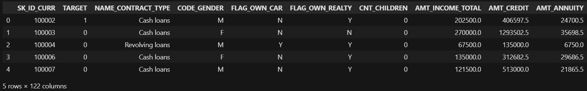
<br>
<br>
<br>

## **DATA PREPROCESSING**

### CLEANING

```sh
dataframe_preprocess = dataframe_ori.copy()
```

```sh
dataframe_preprocess.info(verbose=True, show_counts=True)
```

```sh
<class 'pandas.core.frame.DataFrame'>
RangeIndex: 307511 entries, 0 to 307510
Data columns (total 122 columns):
 #    Column                        Non-Null Count   Dtype  
---   ------                        --------------   -----  
 0    SK_ID_CURR                    307511 non-null  int64  
 1    TARGET                        307511 non-null  int64  
 2    NAME_CONTRACT_TYPE            307511 non-null  object 
 3    CODE_GENDER                   307511 non-null  object 
 4    FLAG_OWN_CAR                  307511 non-null  object 
 5    FLAG_OWN_REALTY               307511 non-null  object 
 6    CNT_CHILDREN                  307511 non-null  int64  
 7    AMT_INCOME_TOTAL              307511 non-null  float64
 8    AMT_CREDIT                    307511 non-null  float64
 9    AMT_ANNUITY                   307499 non-null  float64
 10   AMT_GOODS_PRICE               307233 non-null  float64
 11   NAME_TYPE_SUITE               306219 non-null  object 
 12   NAME_INCOME_TYPE              307511 non-null  object 
 13   NAME_EDUCATION_TYPE           307511 non-null  object 
 14   NAME_FAMILY_STATUS            307511 non-null  object 
 15   NAME_HOUSING_TYPE             307511 non-null  object 
 16   REGION_POPULATION_RELATIVE    307511 non-null  float64
 17   DAYS_BIRTH                    307511 non-null  int64  
 18   DAYS_EMPLOYED                 307511 non-null  int64  
 19   DAYS_REGISTRATION             307511 non-null  float64
 20   DAYS_ID_PUBLISH               307511 non-null  int64  
 21   OWN_CAR_AGE                   104582 non-null  float64
 22   FLAG_MOBIL                    307511 non-null  int64  
 23   FLAG_EMP_PHONE                307511 non-null  int64  
 24   FLAG_WORK_PHONE               307511 non-null  int64  
 25   FLAG_CONT_MOBILE              307511 non-null  int64  
 26   FLAG_PHONE                    307511 non-null  int64  
 27   FLAG_EMAIL                    307511 non-null  int64  
 28   OCCUPATION_TYPE               211120 non-null  object 
 29   CNT_FAM_MEMBERS               307509 non-null  float64
 30   REGION_RATING_CLIENT          307511 non-null  int64  
 31   REGION_RATING_CLIENT_W_CITY   307511 non-null  int64  
 32   WEEKDAY_APPR_PROCESS_START    307511 non-null  object 
 33   HOUR_APPR_PROCESS_START       307511 non-null  int64  
 34   REG_REGION_NOT_LIVE_REGION    307511 non-null  int64  
 35   REG_REGION_NOT_WORK_REGION    307511 non-null  int64  
 36   LIVE_REGION_NOT_WORK_REGION   307511 non-null  int64  
 37   REG_CITY_NOT_LIVE_CITY        307511 non-null  int64  
 38   REG_CITY_NOT_WORK_CITY        307511 non-null  int64  
 39   LIVE_CITY_NOT_WORK_CITY       307511 non-null  int64  
 40   ORGANIZATION_TYPE             307511 non-null  object 
 41   EXT_SOURCE_1                  134133 non-null  float64
 42   EXT_SOURCE_2                  306851 non-null  float64
 43   EXT_SOURCE_3                  246546 non-null  float64
 44   APARTMENTS_AVG                151450 non-null  float64
 45   BASEMENTAREA_AVG              127568 non-null  float64
 46   YEARS_BEGINEXPLUATATION_AVG   157504 non-null  float64
 47   YEARS_BUILD_AVG               103023 non-null  float64
 48   COMMONAREA_AVG                92646 non-null   float64
 49   ELEVATORS_AVG                 143620 non-null  float64
 50   ENTRANCES_AVG                 152683 non-null  float64
 51   FLOORSMAX_AVG                 154491 non-null  float64
 52   FLOORSMIN_AVG                 98869 non-null   float64
 53   LANDAREA_AVG                  124921 non-null  float64
 54   LIVINGAPARTMENTS_AVG          97312 non-null   float64
 55   LIVINGAREA_AVG                153161 non-null  float64
 56   NONLIVINGAPARTMENTS_AVG       93997 non-null   float64
 57   NONLIVINGAREA_AVG             137829 non-null  float64
 58   APARTMENTS_MODE               151450 non-null  float64
 59   BASEMENTAREA_MODE             127568 non-null  float64
 60   YEARS_BEGINEXPLUATATION_MODE  157504 non-null  float64
 61   YEARS_BUILD_MODE              103023 non-null  float64
 62   COMMONAREA_MODE               92646 non-null   float64
 63   ELEVATORS_MODE                143620 non-null  float64
 64   ENTRANCES_MODE                152683 non-null  float64
 65   FLOORSMAX_MODE                154491 non-null  float64
 66   FLOORSMIN_MODE                98869 non-null   float64
 67   LANDAREA_MODE                 124921 non-null  float64
 68   LIVINGAPARTMENTS_MODE         97312 non-null   float64
 69   LIVINGAREA_MODE               153161 non-null  float64
 70   NONLIVINGAPARTMENTS_MODE      93997 non-null   float64
 71   NONLIVINGAREA_MODE            137829 non-null  float64
 72   APARTMENTS_MEDI               151450 non-null  float64
 73   BASEMENTAREA_MEDI             127568 non-null  float64
 74   YEARS_BEGINEXPLUATATION_MEDI  157504 non-null  float64
 75   YEARS_BUILD_MEDI              103023 non-null  float64
 76   COMMONAREA_MEDI               92646 non-null   float64
 77   ELEVATORS_MEDI                143620 non-null  float64
 78   ENTRANCES_MEDI                152683 non-null  float64
 79   FLOORSMAX_MEDI                154491 non-null  float64
 80   FLOORSMIN_MEDI                98869 non-null   float64
 81   LANDAREA_MEDI                 124921 non-null  float64
 82   LIVINGAPARTMENTS_MEDI         97312 non-null   float64
 83   LIVINGAREA_MEDI               153161 non-null  float64
 84   NONLIVINGAPARTMENTS_MEDI      93997 non-null   float64
 85   NONLIVINGAREA_MEDI            137829 non-null  float64
 86   FONDKAPREMONT_MODE            97216 non-null   object 
 87   HOUSETYPE_MODE                153214 non-null  object 
 88   TOTALAREA_MODE                159080 non-null  float64
 89   WALLSMATERIAL_MODE            151170 non-null  object 
 90   EMERGENCYSTATE_MODE           161756 non-null  object 
 91   OBS_30_CNT_SOCIAL_CIRCLE      306490 non-null  float64
 92   DEF_30_CNT_SOCIAL_CIRCLE      306490 non-null  float64
 93   OBS_60_CNT_SOCIAL_CIRCLE      306490 non-null  float64
 94   DEF_60_CNT_SOCIAL_CIRCLE      306490 non-null  float64
 95   DAYS_LAST_PHONE_CHANGE        307510 non-null  float64
 96   FLAG_DOCUMENT_2               307511 non-null  int64  
 97   FLAG_DOCUMENT_3               307511 non-null  int64  
 98   FLAG_DOCUMENT_4               307511 non-null  int64  
 99   FLAG_DOCUMENT_5               307511 non-null  int64  
 100  FLAG_DOCUMENT_6               307511 non-null  int64  
 101  FLAG_DOCUMENT_7               307511 non-null  int64  
 102  FLAG_DOCUMENT_8               307511 non-null  int64  
 103  FLAG_DOCUMENT_9               307511 non-null  int64  
 104  FLAG_DOCUMENT_10              307511 non-null  int64  
 105  FLAG_DOCUMENT_11              307511 non-null  int64  
 106  FLAG_DOCUMENT_12              307511 non-null  int64  
 107  FLAG_DOCUMENT_13              307511 non-null  int64  
 108  FLAG_DOCUMENT_14              307511 non-null  int64  
 109  FLAG_DOCUMENT_15              307511 non-null  int64  
 110  FLAG_DOCUMENT_16              307511 non-null  int64  
 111  FLAG_DOCUMENT_17              307511 non-null  int64  
 112  FLAG_DOCUMENT_18              307511 non-null  int64  
 113  FLAG_DOCUMENT_19              307511 non-null  int64  
 114  FLAG_DOCUMENT_20              307511 non-null  int64  
 115  FLAG_DOCUMENT_21              307511 non-null  int64  
 116  AMT_REQ_CREDIT_BUREAU_HOUR    265992 non-null  float64
 117  AMT_REQ_CREDIT_BUREAU_DAY     265992 non-null  float64
 118  AMT_REQ_CREDIT_BUREAU_WEEK    265992 non-null  float64
 119  AMT_REQ_CREDIT_BUREAU_MON     265992 non-null  float64
 120  AMT_REQ_CREDIT_BUREAU_QRT     265992 non-null  float64
 121  AMT_REQ_CREDIT_BUREAU_YEAR    265992 non-null  float64
dtypes: float64(65), int64(41), object(16)
memory usage: 286.2+ MB
```

#### - Terdapat **122** kolom dan **307511** baris pada data.
#### - Dataframe memiliki **65** float kolom, **41** kolom numerik, dan **16** kolom kategorikal.
<br>
<br>
<br>

### Checking Duplicate Value

```sh
dataframe_preprocess.duplicated().sum()


0
```

#### Secara keseluruhan, **tidak terdapat data duplikat** pada dataset
<br>
<br>
<br>

### Drop Unnecessary Columns
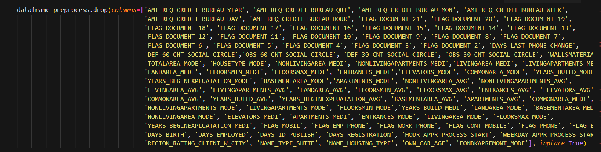
<br>
<br>
<br>

### Checking and Handling Missing Value

```sh
# Mengecek missing value ditiap fitur
missing_values_count = dataframe_preprocess.isnull().sum()
missing_values_count
```

```sh
SK_ID_CURR                          0
TARGET                              0
NAME_CONTRACT_TYPE                  0
CODE_GENDER                         0
FLAG_OWN_CAR                        0
FLAG_OWN_REALTY                     0
CNT_CHILDREN                        0
AMT_INCOME_TOTAL                    0
AMT_CREDIT                          0
AMT_ANNUITY                        12
AMT_GOODS_PRICE                   278
NAME_INCOME_TYPE                    0
NAME_EDUCATION_TYPE                 0
NAME_FAMILY_STATUS                  0
REGION_POPULATION_RELATIVE          0
OCCUPATION_TYPE                 96391
CNT_FAM_MEMBERS                     2
REGION_RATING_CLIENT                0
REG_REGION_NOT_LIVE_REGION          0
REG_REGION_NOT_WORK_REGION          0
LIVE_REGION_NOT_WORK_REGION         0
REG_CITY_NOT_LIVE_CITY              0
REG_CITY_NOT_WORK_CITY              0
LIVE_CITY_NOT_WORK_CITY             0
ORGANIZATION_TYPE                   0
EXT_SOURCE_1                   173378
EXT_SOURCE_2                      660
EXT_SOURCE_3                    60965
EMERGENCYSTATE_MODE            145755
dtype: int64
```

#### Terdapat **8 kolom** missing value pada dataset, akan dilakukan **penghapusan** pada kolom yang memiliki missing value <10% dan **imputasi** jika >10%.

```sh
missing_value = dataframe_preprocess.isnull().sum().reset_index()
missing_value.columns = ['feature', 'missing_value']
missing_value['percentage'] = round((missing_value['missing_value'] / len(dataframe_preprocess)) * 100, 2)
missing_value = missing_value.sort_values('percentage', ascending = False).reset_index(drop = True)
missing_value = missing_value[missing_value['percentage'] > 0]
missing_value
```

```sh
	feature	            missing_value	percentage
0	EXT_SOURCE_1	        173378	        56.38
1	EMERGENCYSTATE_MODE	    145755	        47.40
2	OCCUPATION_TYPE	        96391	        31.35
3	EXT_SOURCE_3	        60965	        19.83
4	EXT_SOURCE_2	        660	            0.21
5	AMT_GOODS_PRICE	        278	            0.09
```

```sh
# Replace missing values with 0 in column: 'EXT_SOURCE_3'
dataframe_preprocess = dataframe_preprocess.fillna({'EXT_SOURCE_3': 0})

# Replace missing values with 0 in column: 'EXT_SOURCE_1'
dataframe_preprocess = dataframe_preprocess.fillna({'EXT_SOURCE_1': 0})

# Replace missing values with the most common value of each column in: 'EMERGENCYSTATE_MODE'
dataframe_preprocess = dataframe_preprocess.fillna({'EMERGENCYSTATE_MODE': dataframe_preprocess['EMERGENCYSTATE_MODE'].mode()[0]})

# Replace missing values with the most common value of each column in: 'EMERGENCYSTATE_MODE'
dataframe_preprocess = dataframe_preprocess.fillna({'OCCUPATION_TYPE': dataframe_preprocess['OCCUPATION_TYPE'].mode()[0]})

# Drop rows with missing data in column: 'CNT_FAM_MEMBERS'
dataframe_preprocess = dataframe_preprocess.dropna(subset=['CNT_FAM_MEMBERS'])

# Drop rows with missing data in column: 'AMT_GOODS_PRICE'
dataframe_preprocess = dataframe_preprocess.dropna(subset=['AMT_GOODS_PRICE'])

# Drop rows with missing data in column: 'AMT_ANNUITY'
dataframe_preprocess = dataframe_preprocess.dropna(subset=['AMT_ANNUITY'])

# Drop rows with missing data in column: 'EXT_SOURCE_2'
dataframe_preprocess = dataframe_preprocess.dropna(subset=['EXT_SOURCE_2'])
```
<br>
<br>
<br>

### Feature Extraction

|Feature Extraction|Reasons|
|:-:|:-:|
|`ORGANIZATION_TYPE`|Simply make it into 4 categories: Business Entity Type 3, Self-employed, Medicine, and Other.|
|`OCCUPATION_TYPE`|Simply make it into 5 categories: Laborers, Sales staff, Core staff, Managers, and Other.|
|`CODE_GENDER`|Delete XNA value.|


```sh
for item in dataframe_preprocess['ORGANIZATION_TYPE'].unique():
  if item in ['Business Entity Type 3', 'Self-employed', 'Medicine']:
    # No change needed for these specific values
    pass
  else:
    dataframe_preprocess.loc[dataframe_preprocess['ORGANIZATION_TYPE'] == item, 'ORGANIZATION_TYPE'] = "Other"
```

```sh
for item in dataframe_preprocess['OCCUPATION_TYPE'].unique():
  if item in ['Laborers', 'Sales staff', 'Core staff', 'Managers']:
    # No change needed for these specific values
    pass
  else:
    dataframe_preprocess.loc[dataframe_preprocess['OCCUPATION_TYPE'] == item, 'OCCUPATION_TYPE'] = "Other"
```

```sh
dataframe_preprocess = dataframe_preprocess.loc[dataframe_preprocess['CODE_GENDER'] != 'XNA']
dataframe_preprocess = dataframe_preprocess.loc[dataframe_preprocess['NAME_FAMILY_STATUS'] != 'Unknown']
```
<br>
<br>
<br>

## **EXPLORATORY DATA ANALYSIS**

### Group Columns by Type

```sh
# Pengelompokan kolom berdasarkan jenisnya
nums = ['int64', 'int32', 'int16', 'float64', 'float32', 'float16']
nums = dataframe_preprocess.select_dtypes(include=nums)
nums = nums.columns

cats = ['object','bool']
cats = dataframe_preprocess.select_dtypes(include=cats)
cats = cats.columns
```
<br>
<br>
<br>

### Univariate Analysis

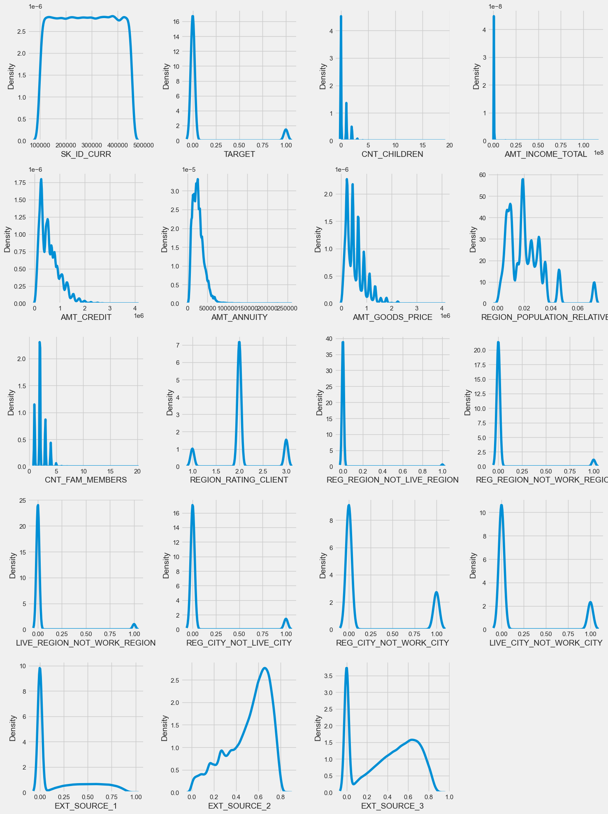
<br>
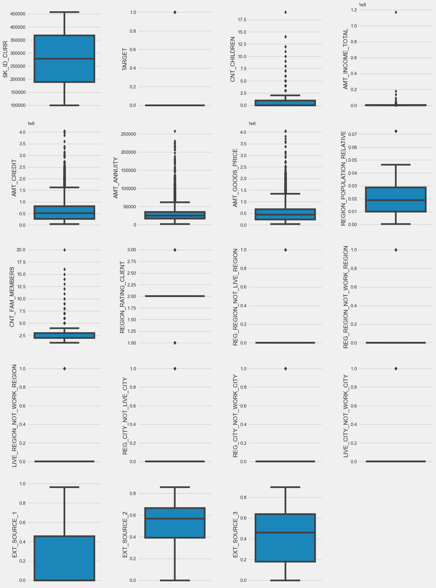

#### Terdapat outlier pada kolom `CNT_CHILDREN`, `AMT_INCOME_TOTAL`, `AMT_CREDIT`, `AMT_ANNUITY`, `AMT_GOODS_PRICE` dan `CNT_FAM_MEMBERS`, yang dimana nanti akan dilakukan penghapusan outliers. <br>

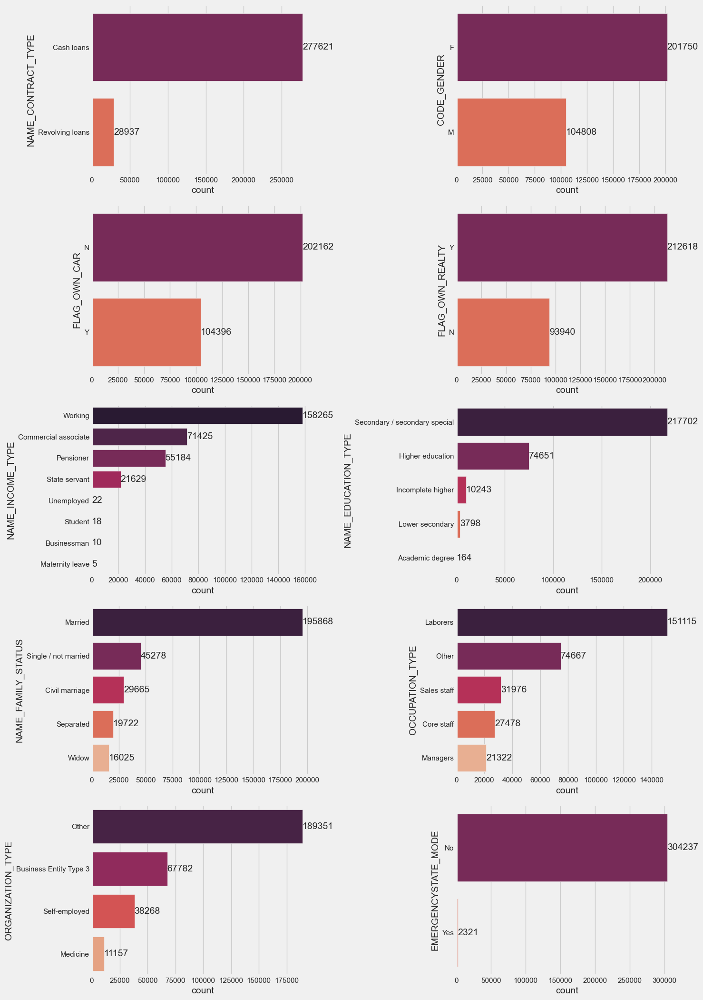
<br>
<br>
<br>

### Multivariate Analysis

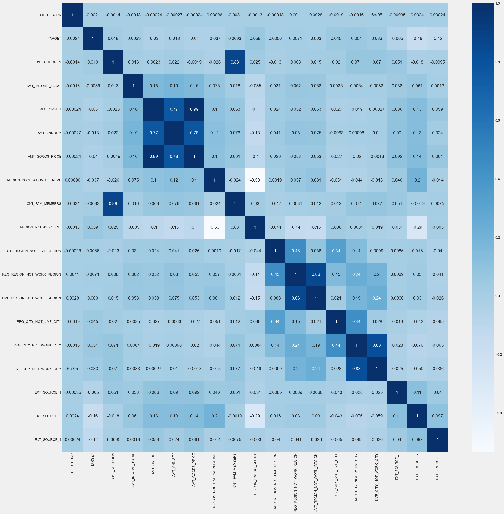

#### `AMT_ANNUITY` & `AMT_CREDIT` memiliki korelasi yang sangat kuat. Ini berarti bahwa Semakin besar pinjaman, semakin besar pula pembayaran anuitasnya. Hal ini wajar karena anuitas dihitung berdasarkan jumlah pinjaman dan tingkat bunga. Namun salah satu akan dihapus karna dapat menyebabkan redundan.

#### `AMT_ANNUITY` & `AMT_GOODS_PRICE` memiliki korelasi yang sangat kuat. Ini berarti bahwa Individu yang membeli barang dengan harga yang lebih mahal cenderung memiliki pinjaman yang lebih besar dan pembayaran anuitas yang lebih tinggi.

#### `AMT_CREDIT` & `AMT_GOODS_PRICE` memiliki korelasi yang sangat kuat. Ini berarti bahwa Individu dengan pendapatan yang lebih tinggi mungkin membeli barang dengan harga yang lebih mahal, memiliki pinjaman yang lebih besar.
<br>
<br>
<br>

## **FEATURE ENGINEERING**

```sh
dataframe_fe = dataframe_preprocess.copy()
```

### Feature Encoding

```sh
for cats in ['NAME_CONTRACT_TYPE']:
  onehots = pd.get_dummies(dataframe_fe[cats], prefix=cats)
  dataframe_fe = dataframe_fe.join(onehots)
```

```sh
mapping_grade = {
    'Lower secondary' : 1,
    'Secondary / secondary special' : 2,
    'Incomplete higher' : 3,
    'Higher education' : 4,
    'Academic degree' : 5}

dataframe_fe['NAME_EDUCATION_TYPE'] = dataframe_fe['NAME_EDUCATION_TYPE'].map(mapping_grade)
```

```sh
dataframe_fe['NAME_INCOME_TYPE'] = dataframe_fe['NAME_INCOME_TYPE'].astype('category').cat.codes
dataframe_fe['CODE_GENDER'] = dataframe_fe['CODE_GENDER'].astype('category').cat.codes
dataframe_fe['FLAG_OWN_CAR'] = dataframe_fe['FLAG_OWN_CAR'].astype('category').cat.codes
dataframe_fe['FLAG_OWN_REALTY'] = dataframe_fe['FLAG_OWN_REALTY'].astype('category').cat.codes
dataframe_fe['EMERGENCYSTATE_MODE'] = dataframe_fe['EMERGENCYSTATE_MODE'].astype('category').cat.codes
dataframe_fe['OCCUPATION_TYPE'] = dataframe_fe['OCCUPATION_TYPE'].astype('category').cat.codes
dataframe_fe['NAME_FAMILY_STATUS'] = dataframe_fe['NAME_FAMILY_STATUS'].astype('category').cat.codes
dataframe_fe['ORGANIZATION_TYPE'] = dataframe_fe['ORGANIZATION_TYPE'].astype('category').cat.codes
```
<br>
<br>
<br>

### Class Imbalance

```sh
# Melihat berapa dejarat ketimpangan pada class

for i in range(len(dataframe_fe['TARGET'].value_counts())):
    a = round(dataframe_fe['TARGET'].value_counts()[i]/dataframe_fe.shape[0]*100,2)
    print(f'{a}%')


91.93%
8.07%
```

```sh
# Membuat kolom baru untuk melihat Class 'Yes'

dataframe_fe['Target_class'] = dataframe_fe['TARGET']==1
dataframe_fe['Target_class'].value_counts()


False    281806
True      24752
Name: Target_class, dtype: int64
```

```sh
# Memisahkan dataframe tanpa Response dan Res_class dan hanya Res_class
X = dataframe_fe[[col for col in dataframe_fe.columns if (str(dataframe_fe[col].dtype) != 'object') and col not in ['TARGET', 'Target_class']]]
y = dataframe_fe['Target_class'].values
print(X.shape)
print(y.shape)


(306558, 29)
(306558,)
```

```sh
X_over_SMOTE, y_over_SMOTE = over_sampling.SMOTE(sampling_strategy=0.3, random_state=99).fit_resample(X, y)
```

```sh
pd.Series(y_over_SMOTE).value_counts()


False    281806
True      84541
dtype: int64
```

```sh
X_over_SMOTE['TARGET'] = y_over_SMOTE.astype(int)
dataframe_fe = X_over_SMOTE.copy()
```

```sh
# Memisahkan dataframe tanpa Response dan Res_class dan hanya Res_class
dataframe_fe['Target_class'] = dataframe_fe['TARGET']==1
dataframe_fe['Target_class'].value_counts()
X2 = dataframe_fe[[col for col in dataframe_fe.columns if (str(dataframe_fe[col].dtype) != 'object') and col not in ['TARGET', 'Target_class']]]
y2 = dataframe_fe['Target_class'].values
print(X2.shape)
print(y2.shape)


(366347, 29)
(366347,)
```

```sh
X_under, y_under = under_sampling.RandomUnderSampler(sampling_strategy=1, random_state=99).fit_resample(X2, y2)
```

```sh
print('Original')
print(pd.Series(y).value_counts())
print('\n')
print('OVERSAMPLING SMOTE & UNDERSAMPLING')
print('')
print(pd.Series(y_under).value_counts())


Original
False    281806
True      24752
dtype: int64


OVERSAMPLING SMOTE & UNDERSAMPLING

False    84541
True     84541
dtype: int64
```

```sh
X_under['TARGET'] = y_under.astype(int)
dataframe_fe = X_under.copy()
```
<br>
<br>
<br>

### Handling Outliers

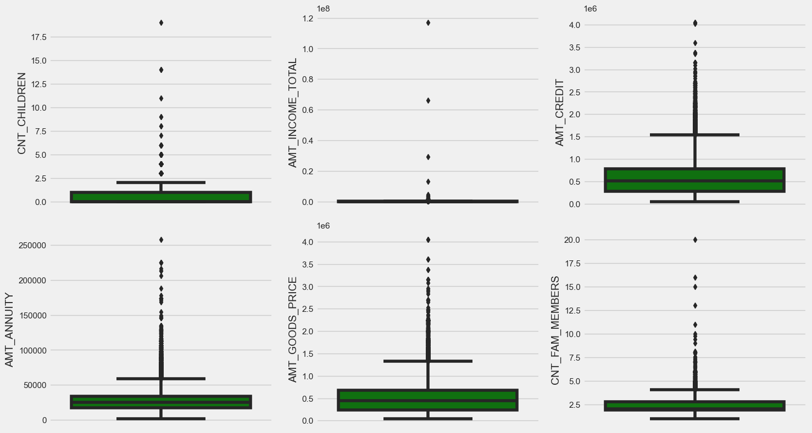

```sh
print(f'Jumlah baris sebelum memfilter outlier: {len(dataframe_fe)}')

cleaning_outliers = np.array([True] * len(dataframe_fe))
for col in outliers:
    Q1 = dataframe_fe[col].quantile(0.25)
    Q3 = dataframe_fe[col].quantile(0.75)
    IQR = Q3 - Q1
    low_limit = Q1 - (IQR * 1.5)
    high_limit = Q3 + (IQR * 1.5)

    cleaning_outliers = ((dataframe_fe[col] >= low_limit) & (dataframe_fe[col] <= high_limit)) & cleaning_outliers
    
dataframe_fe = dataframe_fe[cleaning_outliers]

print(f'Jumlah baris setelah memfilter outlier: {len(dataframe_fe)}')


Jumlah baris sebelum memfilter outlier: 169082
Jumlah baris setelah memfilter outlier: 153489
```

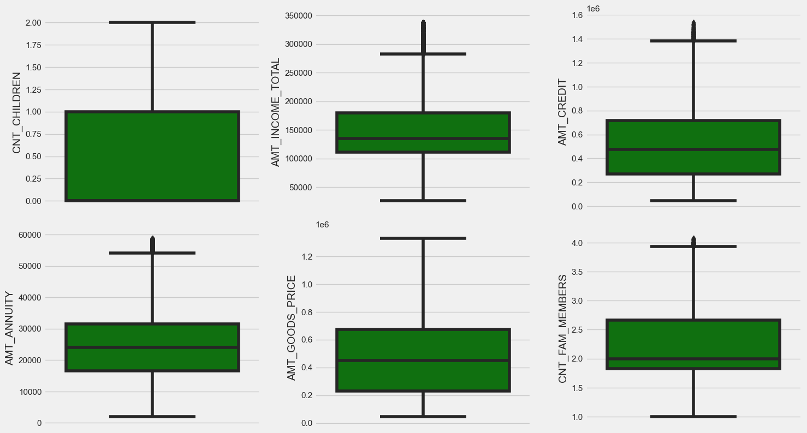
<br>
<br>
<br>

## **MODELING**

```sh
dataframe_model = dataframe_fe.copy()
```

```sh
drop_columns = ['SK_ID_CURR','AMT_GOODS_PRICE','EMERGENCYSTATE_MODE','AMT_INCOME_TOTAL','REG_REGION_NOT_LIVE_REGION','REG_REGION_NOT_WORK_REGION','REG_CITY_NOT_LIVE_CITY','REG_CITY_NOT_WORK_CITY','FLAG_OWN_REALTY','CODE_GENDER','TARGET','CNT_CHILDREN','AMT_ANNUITY']
```

```sh
# Pisahkan fitur dan target
X = dataframe_model.drop(drop_columns, axis=1)
y = dataframe_model['TARGET']

# Bagi data menjadi train dan test
X_train, X_test, y_train, y_test = train_test_split(X, y, test_size=0.3, random_state=99)
```


```sh
# Pisahkan fitur dan target
X = dataframe_model.drop(drop_columns, axis=1)
y = dataframe_model['TARGET']

# Bagi data menjadi train dan test
def eval_classification(model):
    y_pred = model.predict(X_test)
    y_pred_train = model.predict(X_train)
    y_pred_proba = model.predict_proba(X_test)
    y_pred_proba_train = model.predict_proba(X_train)

    print("Accuracy (Test Set): %.2f" % accuracy_score(y_test, y_pred))
    print("Accuracy (Train Set): %.2f" % accuracy_score(y_train, y_pred_train))
    print("Precision (Test Set): %.2f" % precision_score(y_test, y_pred))
    print("Precision (Train Set): %.2f" % precision_score(y_train, y_pred_train))
    print("Recall (Test Set): %.2f" % recall_score(y_test, y_pred))
    print("Recall (Train Set): %.2f" % recall_score(y_train, y_pred_train))
    print("F1-Score (Test Set): %.2f" % f1_score(y_test, y_pred))
    print("F1-Score (Train Set): %.2f" % f1_score(y_train, y_pred_train))

    print("roc_auc (test-proba): %.2f" % roc_auc_score(y_test, y_pred_proba[:, 1]))
    print("roc_auc (train-proba): %.2f" % roc_auc_score(y_train, y_pred_proba_train[:, 1]))

    score = cross_validate(RandomForestClassifier(), X, y, cv=5, scoring='roc_auc', return_train_score=True)
    print('roc_auc (crossval train): '+ str(score['train_score'].mean()))
    print('roc_auc (crossval test): '+ str(score['test_score'].mean()))

def show_feature_importance(model):
    feat_importances = pd.Series(model.feature_importances_, index=X.columns)
    ax = feat_importances.nlargest(25).plot(kind='barh', figsize=(10, 8))
    ax.invert_yaxis()

    plt.xlabel('score')
    plt.ylabel('feature')
    plt.title('feature importance score')

def show_best_hyperparameter(model):
    print(model.best_estimator_.get_params())

lg = LogisticRegression(random_state=99)
knn = KNeighborsClassifier()
dt = DecisionTreeClassifier(random_state=99)
xgb = XGBClassifier(random_state=99)
rf = RandomForestClassifier(random_state=99)
lgb = LGBMClassifier(random_state=99)
grd = GradientBoostingClassifier(random_state=99)
```
<br>
<br>
<br>

### Logistic Regression

```sh
Accuracy (Test Set): 0.51
Accuracy (Train Set): 0.51
Precision (Test Set): 0.51
Precision (Train Set): 0.51
Recall (Test Set): 1.00
Recall (Train Set): 1.00
F1-Score (Test Set): 0.67
F1-Score (Train Set): 0.68
roc_auc (test-proba): 0.50
roc_auc (train-proba): 0.50
roc_auc (crossval train): 0.99999999965498
roc_auc (crossval test): 0.9024564114422542
```

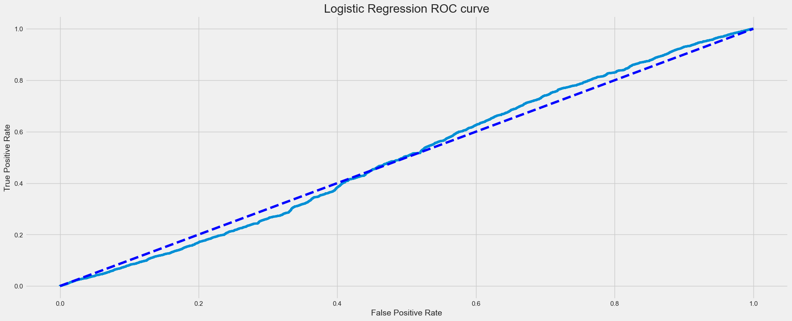
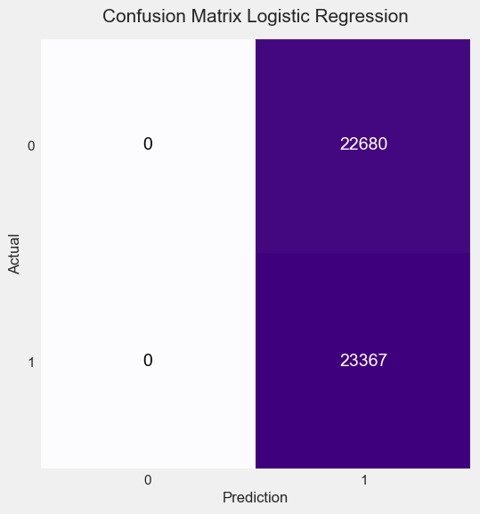

### Hyperparameter Tuning

```sh
Fitting 3 folds for each of 300 candidates, totalling 900 fits
Accuracy (Test Set): 0.51
Accuracy (Train Set): 0.51
Precision (Test Set): 0.51
Precision (Train Set): 0.51
Recall (Test Set): 1.00
Recall (Train Set): 1.00
F1-Score (Test Set): 0.67
F1-Score (Train Set): 0.68
roc_auc (test-proba): 0.50
roc_auc (train-proba): 0.50
roc_auc (crossval train): 1.0
roc_auc (crossval test): 0.9017439291251691
```
<br>
<br>
<br>

### K-Nearest Neighbor

```sh
Accuracy (Test Set): 0.74
Accuracy (Train Set): 0.83
Precision (Test Set): 0.76
Precision (Train Set): 0.86
Recall (Test Set): 0.70
Recall (Train Set): 0.79
F1-Score (Test Set): 0.73
F1-Score (Train Set): 0.82
roc_auc (test-proba): 0.81
roc_auc (train-proba): 0.91
roc_auc (crossval train): 0.999999999601896
roc_auc (crossval test): 0.9019836752175815
```

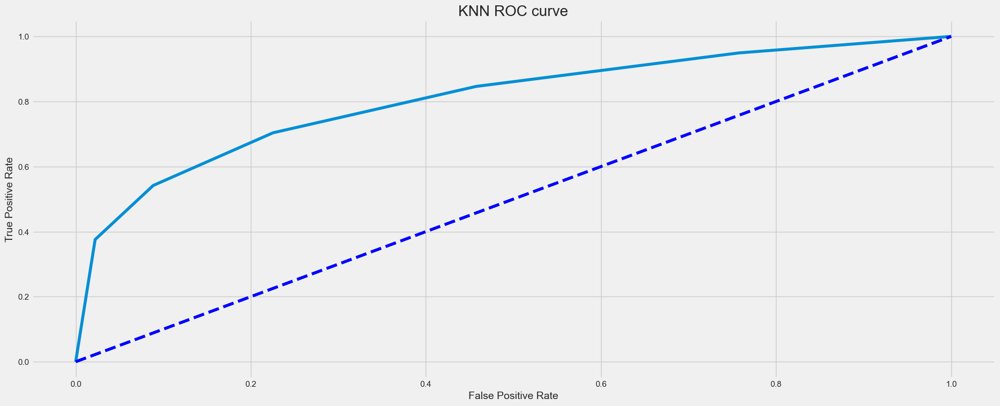
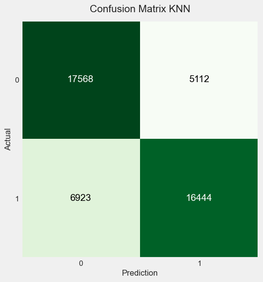

### Hyperparameter Tuning

```sh
Accuracy (Test Set): 0.75
Accuracy (Train Set): 0.83
Precision (Test Set): 0.78
Precision (Train Set): 0.87
Recall (Test Set): 0.70
Recall (Train Set): 0.79
F1-Score (Test Set): 0.74
F1-Score (Train Set): 0.83
roc_auc (test-proba): 0.81
roc_auc (train-proba): 0.92
roc_auc (crossval train): 1.0
roc_auc (crossval test): 0.9017938353178829
```
<br>
<br>
<br>

### Decision Tree

```sh
Accuracy (Test Set): 0.75
Accuracy (Train Set): 1.00
Precision (Test Set): 0.75
Precision (Train Set): 1.00
Recall (Test Set): 0.76
Recall (Train Set): 1.00
F1-Score (Test Set): 0.75
F1-Score (Train Set): 1.00
roc_auc (test-proba): 0.75
roc_auc (train-proba): 1.00
roc_auc (crossval train): 0.9999999999203796
roc_auc (crossval test): 0.9018625700713129
```

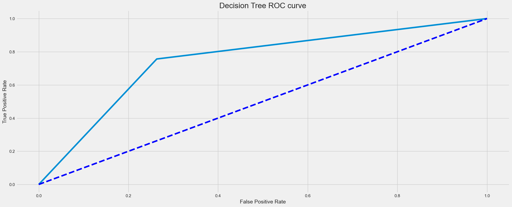
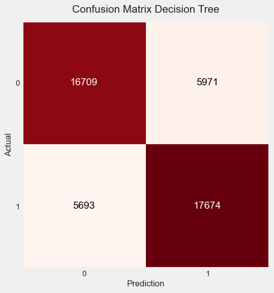
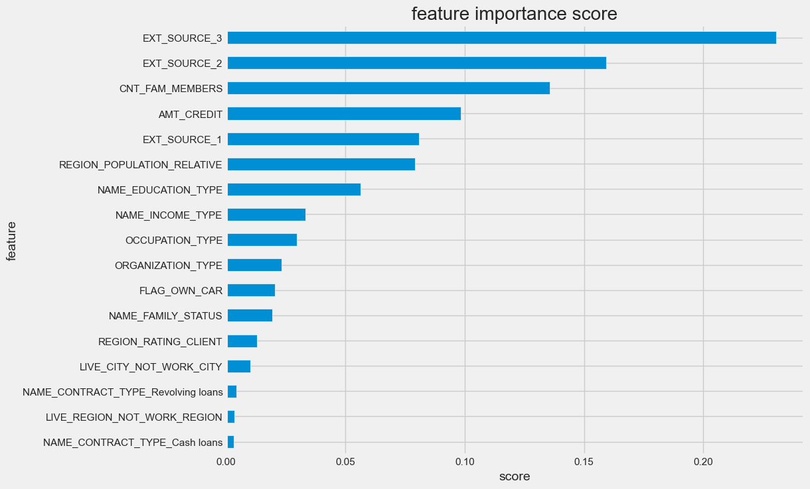

### Hyperparameter Tuning

```sh
Accuracy (Test Set): 0.78
Accuracy (Train Set): 0.82
Precision (Test Set): 0.82
Precision (Train Set): 0.86
Recall (Test Set): 0.74
Recall (Train Set): 0.77
F1-Score (Test Set): 0.78
F1-Score (Train Set): 0.82
roc_auc (test-proba): 0.86
roc_auc (train-proba): 0.91
roc_auc (crossval train): 1.0
roc_auc (crossval test): 0.9015220702693956
```
<br>
<br>
<br>

### XGBoost

```sh
Accuracy (Test Set): 0.85
Accuracy (Train Set): 0.87
Precision (Test Set): 0.91
Precision (Train Set): 0.93
Recall (Test Set): 0.78
Recall (Train Set): 0.80
F1-Score (Test Set): 0.84
F1-Score (Train Set): 0.86
roc_auc (test-proba): 0.91
roc_auc (train-proba): 0.94
roc_auc (crossval train): 0.9999999998672987
roc_auc (crossval test): 0.9019639988922219
```

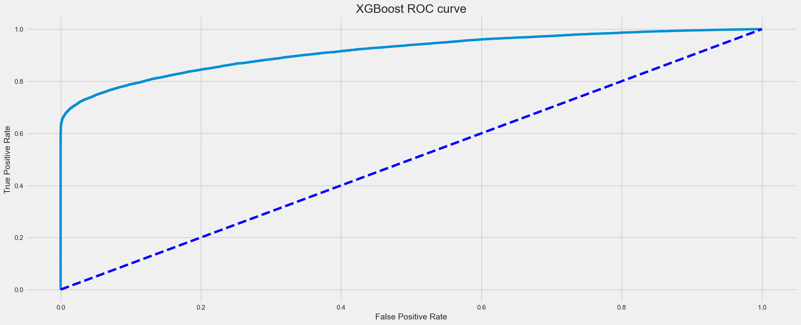
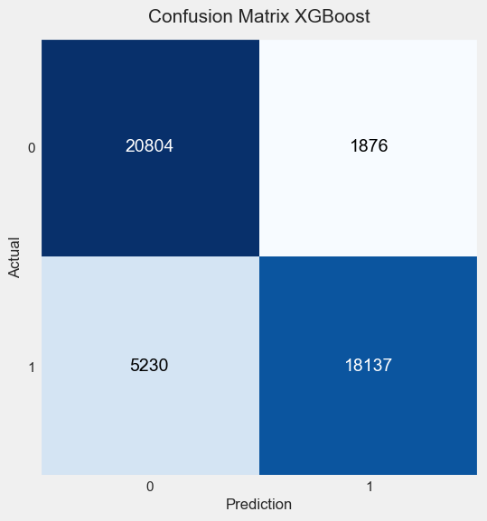
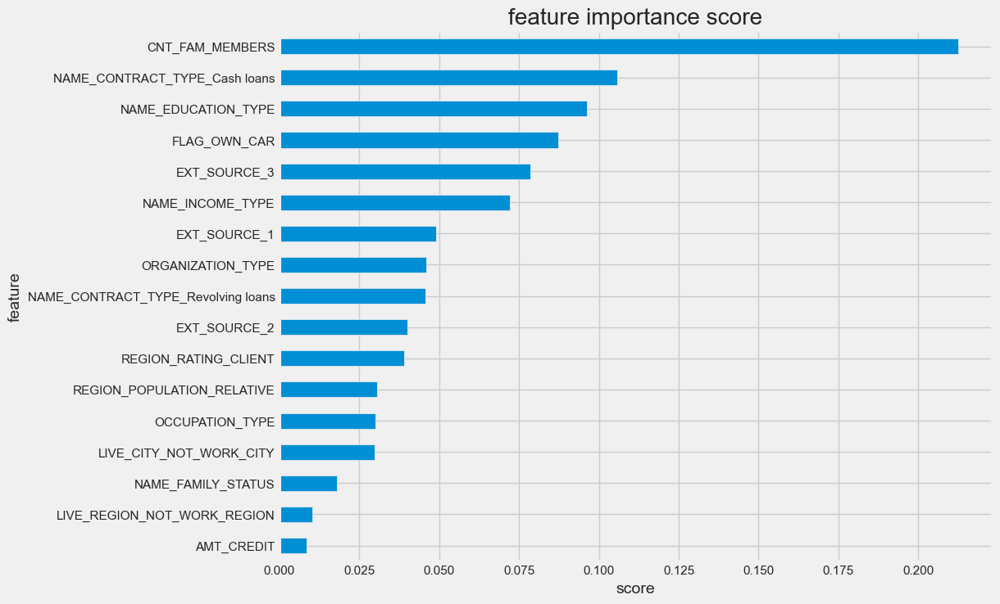

### Hyperparameter Tuning

```sh
Accuracy (Test Set): 0.86
Accuracy (Train Set): 0.86
Precision (Test Set): 0.94
Precision (Train Set): 0.94
Recall (Test Set): 0.77
Recall (Train Set): 0.77
F1-Score (Test Set): 0.85
F1-Score (Train Set): 0.85
roc_auc (test-proba): 0.92
roc_auc (train-proba): 0.93
roc_auc (crossval train): 1.0
roc_auc (crossval test): 0.9022823571974584
```
<br>
<br>
<br>

### Random Forest

```sh
Accuracy (Test Set): 0.83
Accuracy (Train Set): 1.00
Precision (Test Set): 0.87
Precision (Train Set): 1.00
Recall (Test Set): 0.78
Recall (Train Set): 1.00
F1-Score (Test Set): 0.82
F1-Score (Train Set): 1.00
roc_auc (test-proba): 0.90
roc_auc (train-proba): 1.00
roc_auc (crossval train): 1.0
roc_auc (crossval test): 0.9018514812722254
```


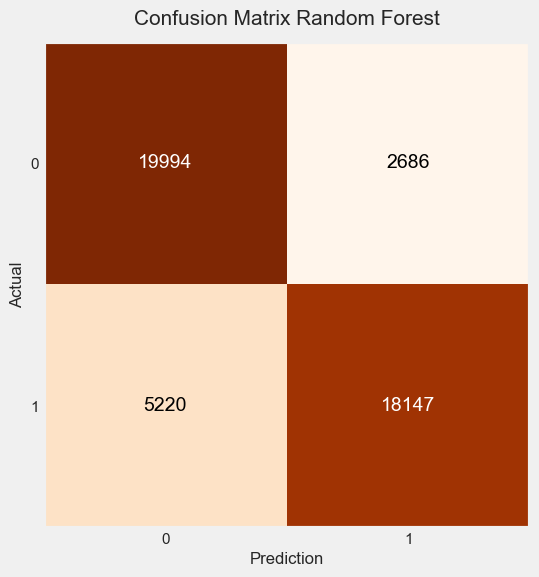
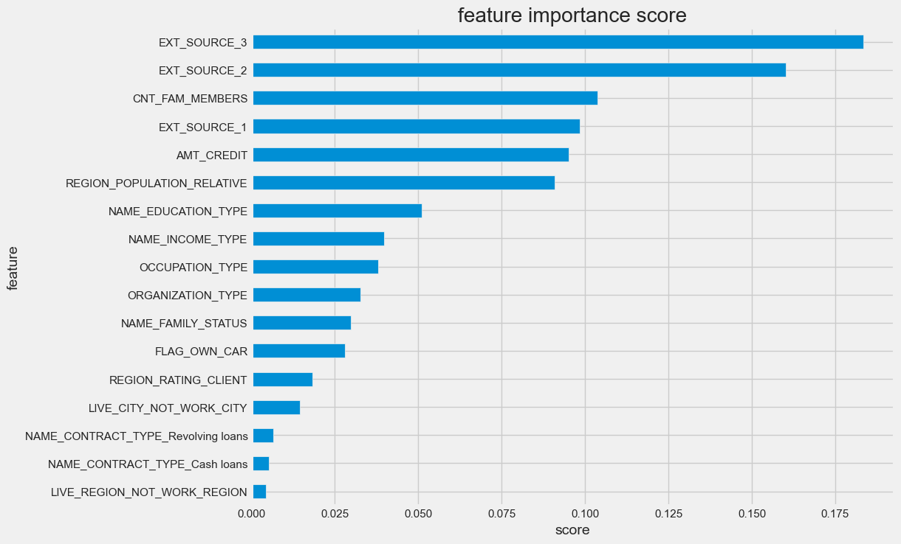

### Hyperparameter Tuning

```sh
Accuracy (Test Set): 0.83
Accuracy (Train Set): 0.92
Precision (Test Set): 0.87
Precision (Train Set): 0.96
Recall (Test Set): 0.78
Recall (Train Set): 0.88
F1-Score (Test Set): 0.82
F1-Score (Train Set): 0.92
roc_auc (test-proba): 0.90
roc_auc (train-proba): 0.98
roc_auc (crossval train): 0.9999999998407585
roc_auc (crossval test): 0.9017784623584992
```
<br>
<br>
<br>

### LightGBM

```sh
Accuracy (Test Set): 0.85
Accuracy (Train Set): 0.86
Precision (Test Set): 0.91
Precision (Train Set): 0.92
Recall (Test Set): 0.77
Recall (Train Set): 0.78
F1-Score (Test Set): 0.84
F1-Score (Train Set): 0.85
roc_auc (test-proba): 0.92
roc_auc (train-proba): 0.92
roc_auc (crossval train): 0.9999999999734598
roc_auc (crossval test): 0.9019105155317156
```


### Hyperparameter Tuning

```sh
Accuracy (Test Set): 0.85
Accuracy (Train Set): 0.93
Precision (Test Set): 0.91
Precision (Train Set): 0.98
Recall (Test Set): 0.78
Recall (Train Set): 0.88
F1-Score (Test Set): 0.84
F1-Score (Train Set): 0.92
roc_auc (test-proba): 0.92
roc_auc (train-proba): 0.99
roc_auc (crossval train): 1.0
roc_auc (crossval test): 0.9019396531510679
```
<br>
<br>
<br>

### Gradient Boost

```sh
Accuracy (Test Set): 0.83
Accuracy (Train Set): 0.83
Precision (Test Set): 0.87
Precision (Train Set): 0.88
Recall (Test Set): 0.77
Recall (Train Set): 0.78
F1-Score (Test Set): 0.82
F1-Score (Train Set): 0.82
roc_auc (test-proba): 0.90
roc_auc (train-proba): 0.91
roc_auc (crossval train): 0.9999999998938407
roc_auc (crossval test): 0.9019642595373162
```

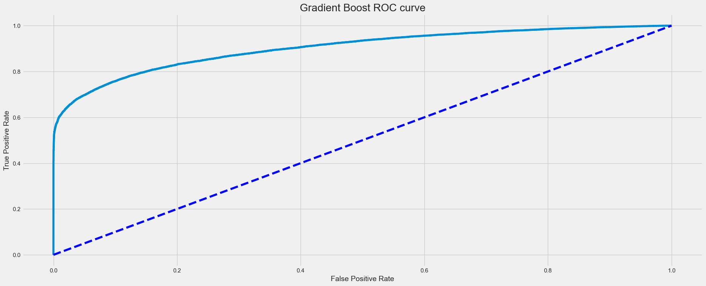
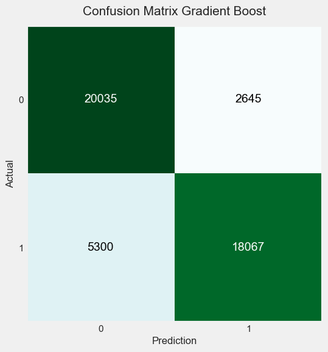
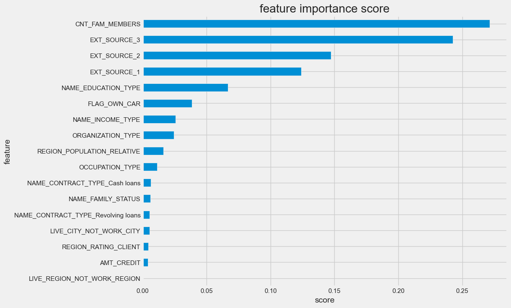

### Hyperparameter Tuning

```sh
Accuracy (Test Set): 0.85
Accuracy (Train Set): 0.86
Precision (Test Set): 0.92
Precision (Train Set): 0.93
Recall (Test Set): 0.77
Recall (Train Set): 0.78
F1-Score (Test Set): 0.84
F1-Score (Train Set): 0.85
roc_auc (test-proba): 0.92
roc_auc (train-proba): 0.93
roc_auc (crossval train): 0.9999999994691949
roc_auc (crossval test): 0.9019102012522078
```
<br>
<br>
<br>

# **CONCLUSION**

#### Model yang dipilih adalah model XGBoost yang sudah di tuning parameternya. Metrix utama yang digunakan adalah `Accuracy` yang dimana Metrik ini menunjukkan persentase prediksi yang benar dibandingkan dengan total prediksi. Accuracy yang tinggi menunjukkan bahwa model dapat memprediksi skor kredit dengan baik.
<br>
<br>
<br>

# **THE BEST FIT MODEL**
## **XGBoost Model**

Model ini memiliki score accuracy yang tinggi yakni mencapai **0.86** dengan probabilitas machine learning sebesar **0.86**. Model tidak overfit maupun underfit yang dapat disebut sebagai model ***best fit***. <br>

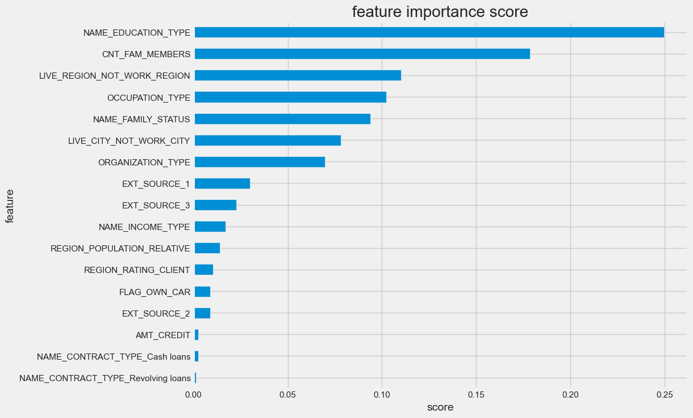
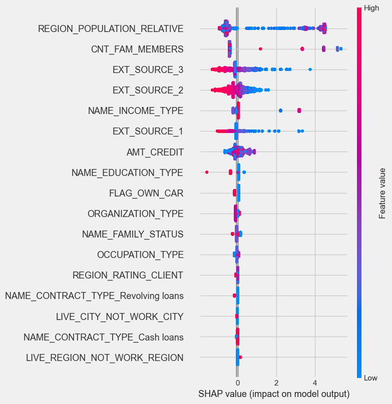

# **Business Recomendations**

#### - `Penargetan Berdasarkan Tingkat Pendidikan`: tingkat pendidikan memiliki pengaruh yang signifikan terhadap kemungkinan individu memiliki kredit yang baik. Individu dengan tingkat pendidikan yang lebih tinggi umumnya memiliki penghasilan yang lebih tinggi dan stabilitas kerja yang lebih baik, sehingga mereka lebih kecil kemungkinannya untuk gagal membayar pinjaman. <br>
#### - `Penawaran Kredit Berdasarkan Jumlah Anggota Keluarga`: anggota keluarga memiliki pengaruh terhadap kemungkinan individu memiliki kredit yang baik. Individu dengan jumlah anggota keluarga yang lebih sedikit mungkin memiliki beban keuangan yang lebih ringan dan lebih mampu mengelola pembayaran pinjaman. <br>
#### - `Mempertimbangkan Ketidakcocokan Tempat Tinggal dan Tempat Kerja`: lokasi tempat tinggal dan tempat kerja individu dapat memengaruhi kemungkinan mereka memiliki kredit yang baik. Individu yang tinggal di wilayah yang sama dengan tempat kerja mereka mungkin lebih mudah diverifikasi dan dianggap memiliki risiko kredit yang lebih rendah. <br>
#### - `Mempertimbangkan Jenis Pekerjaan`: jenis pekerjaan individu dapat memengaruhi kemungkinan mereka memiliki kredit yang baik. Individu dengan pekerjaan yang stabil dan berpenghasilan tetap mungkin dianggap memiliki risiko kredit yang lebih rendah. <br>
#### - `Menargetkan Berdasarkan Status Pernikahan`: status pernikahan individu dapat memengaruhi kemungkinan mereka memiliki kredit yang baik. Individu yang menikah mungkin memiliki stabilitas keuangan yang lebih baik dan lebih kecil kemungkinannya untuk gagal membayar pinjaman.


